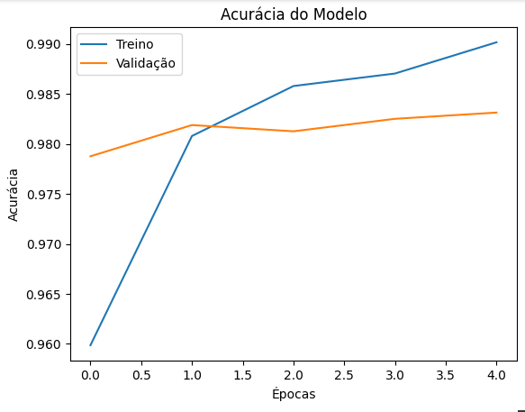
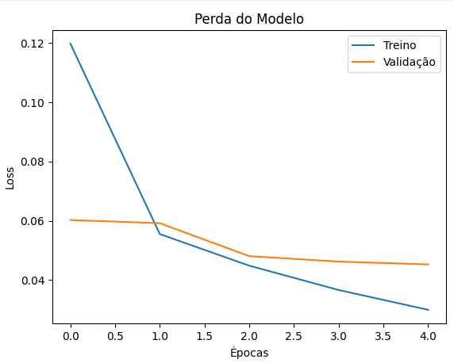

# 🐱🐶 Classificador de Gatos e Cachorros com Transfer Learning

Este projeto utiliza **Transfer Learning** com o modelo **MobileNetV2** para classificar imagens de gatos e cachorros com alta precisão. A proposta foi aplicar técnicas de Visão Computacional com um modelo pré-treinado, adaptando-o para uma tarefa binária simples, mas muito comum e útil.

---

## 📖 Storytelling

A identificação de imagens é uma das áreas mais poderosas da inteligência artificial moderna. Neste projeto, propus um desafio simples e muito comum no campo da visão computacional: treinar um modelo capaz de distinguir entre imagens de **gatos e cachorros**.

Para isso, utilizei a técnica de **Transfer Learning**, que consiste em reaproveitar o conhecimento de um modelo já treinado em um grande conjunto de dados (neste caso, o MobileNetV2, pré-treinado no ImageNet) para resolver uma tarefa diferente — neste caso, classificar imagens como "gato" ou "cachorro".

---

## 🧠 O que foi feito

- Carregamento e preparação do dataset contendo pastas de treino, validação e teste.
- Normalização e divisão dos dados com `ImageDataGenerator`.
- Utilização do modelo pré-treinado **MobileNetV2**, com camadas finais ajustadas para classificação binária.
- Treinamento do modelo com validação durante o processo.
- Avaliação com dados de teste e imagens individuais externas.

---

## 🔍 Tecnologias Utilizadas

- Python
- TensorFlow / Keras
- MobileNetV2 (pré-treinado com ImageNet)
- Google Colab
- Matplotlib
- Numpy

---

---

## 📊 Resultados

### Gráfico de Acurácia e Perda

### 📊 Análise dos Gráficos

Os gráficos de acurácia e perda demonstram que o modelo teve um ótimo desempenho durante o treinamento. A acurácia aumentou de forma consistente, tanto nos dados de treino quanto nos de validação, alcançando cerca de 99% e 98% respectivamente. Já a perda (loss) apresentou uma queda significativa ao longo das épocas, indicando que o modelo aprendeu bem os padrões dos dados. Além disso, a diferença entre os conjuntos de treino e validação é pequena, o que mostra que o modelo generaliza bem e não está sofrendo overfitting.

---

### ✅ Resultado:
- 🐱 A imagem de gato foi corretamente classificada como gato.
- 🐶 A imagem de cachorro foi corretamente classificada como cachorro.

---

## 📌 Conclusão

Este projeto demonstra como o **Transfer Learning** pode ser extremamente eficaz para tarefas de classificação de imagens, mesmo com um volume moderado de dados. Com poucos ajustes e tempo de treinamento reduzido, conseguimos construir um modelo robusto e confiável, que pode servir como base para aplicações reais — como apps de identificação de animais ou sistemas de monitoramento por imagem.

---

## Link do Kaggle para download da base de dados
- https://www.kaggle.com/datasets/dineshpiyasamara/cats-and-dogs-for-classification

